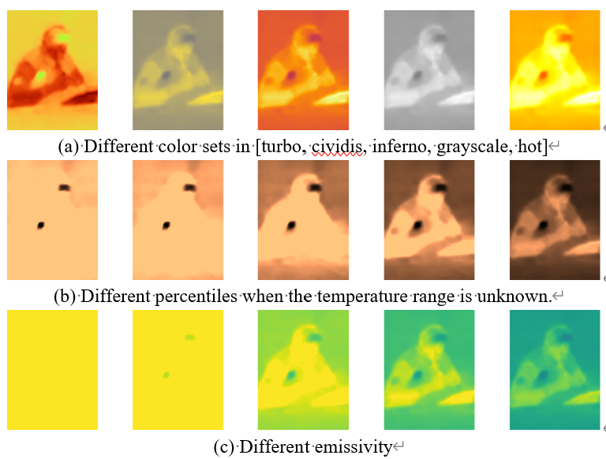
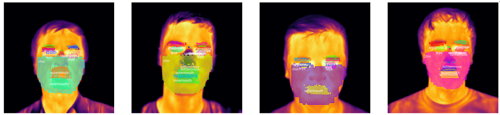

# IRT-Face-OD
Infrared Thermal Face Object Detection Framework

## Features

- FLIR image preprocessing with `flyr` and image processing toolkits
- Multimodal Infrared Thermal Face Object Detection

## Results

- FLIR images with different color palettes

- Face part detection results

## Our open-source toolkits

- [irt-data-utils](https://pypi.org/project/irt-data-utils/): Infrared Thermal Data Utils

- [irt-camera](https://pypi.org/project/irt-camera/): An upper computer program receiving 32*24 thermal data from MLX90640 using GY-MCU90640.

- [IRT-AI](https://pypi.org/project/IRT-AI/):A series of deep learning-based methods to handle thermal images

## Credits

We used the following projects in our work.

- [flyr](https://pypi.org/project/flyr/): Flyr is a library for extracting thermal data from FLIR images written fully in Python, without depending on ExifTool.

- [mediapipe](https://pypi.org/project/mediapipe/): MediaPipe is the simplest way for researchers and developers to build world-class ML solutions and applications for mobile, edge, cloud and the web.

- [Mask-RCNN](https://arxiv.org/abs/1703.06870): Mask R-CNN is a Convolutional Neural Network (CNN) and state-of-the-art in terms of image segmentation.

## License

MIT

